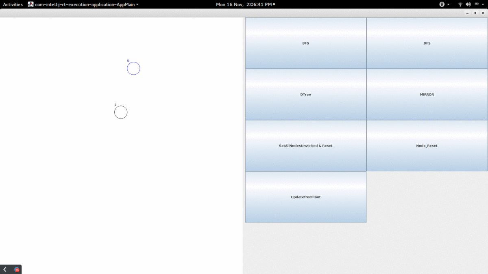

# graph_java_GUI

This is a project written on Java with a GUI for the course **Data Structures and algorithms** while doing my UG in CSE at Shiv Nadar University

- BFS
- DFS
- Dtree

The soruce code is attached , but i dont honstly work on Java anymore . But if someone wants help i can document this further more , 

Till then , enjoy! :)

     