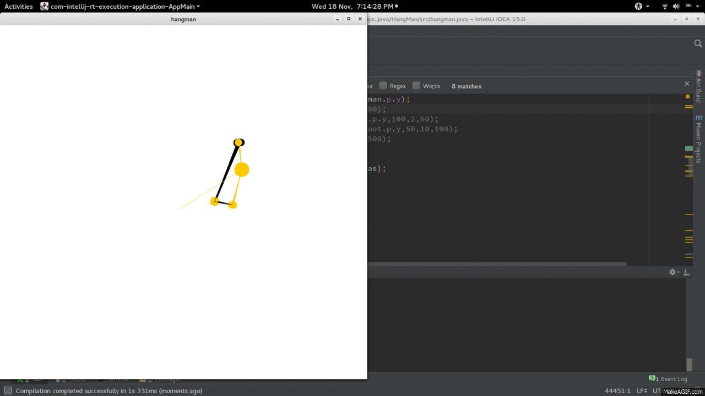

### AIM: To model a HangMan using Object Oriented Approach on Java.

 

How I have Tried to solve the problem
-  1. Model a HangMan Class
-  2. Use the HangMan Class to make Objects like
	• Head
	• LeftLeg
	• LeftFoot
	• RightFoot
	• RightLeg
	• Man
Then I have used the Graph Data Structure to link them together
	
	man.push(LeftLeg)
	LeftLeg.push(LeftFoot)
	man.push(RightLeg)
	RightLeg.push(RightFoot)
	man.push(Head)

What you are seeing above is the way by which the DataStructure is - Linkek to create an

- entity called “man”.

- The man object (man is an object of the hangman class) , this can be controlled my just altering
- the position & angle . I have written recursive functions which will take care of the the
RELATIVE position of all the other entities

#### I have been able to refresh my understanding of
---------------------------------------------------------------------------------

- 1. Coordinate Geometry
- 2. Physics
- 3. DataStructures
### REMARKS

I tried to model the hangman in the correct ObjectOriented Approach , but due to some reason its
not working to the best of my wishes .I believe the problem lies in the recursive function that
updates the position of the entitiy called “man”.

-  I have used something called Jcanvas.java & JqueueEvent.java , they are both opensource libraries
